# Assesments

- lab quiz: 30
>- lab 2: 5%
>- lab 3 5%
>- final quiz (timed): 20%
- project: 20% (week 7-12)
- quizzes: 20%
>- quiz 1 (Computer architecture): 10%
>- quiz 2 (Computer organisation): 10%
- final exam: 30%

# ict 1011 pre req for

- inf 2004
- ict 2215
- ict 3125
- ict 3213

# Labs
One lab every 2 weeks, CHECK SCHEDULE

pre req: code composer software by Texas Instruments

lab 1 (Week 3/4) MSP430 (microprocessor)
lab 2 (Week 5/6) address mode & data storage
> Lab 2 quiz due week 7
lab 3 (week 8/9) assembly instructions
> lab 3 quiz due week 10
lab 4 (week 10/11)project familiarisation

# Project

Come up with project for tiny screen smart watch kit
Teams of 6
Choose own team mate by week 5 or get auto assigned

# Computer Architecture
vvv
## Fundamentals of Computer Architecture (Chpt 1)

### History and Evolution of Computers
- 1834, Cambridge, UK
>- Built by Charles Babbage
>- Designs: Difference Engine (Subtractor), Analytical Diffrence Engine
>- Mechanical

- 1940, Germany
>- Built by Konrad Zuse
>- used electrical relays

Major leap during ww2 (1940s)  
Research funded mainly by the War Department  
Looked to solve problems related to balistics calculations or cryptography over telegram

- 1943, Bletchley Park, UK
>- Built by: Tommy Flowers, Alan Turing
>- Designs: Colossus (Code breaker)
>- 10 seperate copies, electronic and programable.

- 1944, USA
>- Built by:
>- Designs: ENIAC(Code beraker)
>- Similar to Colossus

- ????, Princeton University
>- Built By: John Von Neumann
>- Design: Stored Program Concept (Architecture)
>- Purpose: To create a way to allow the samee machine to run different programs, no longer purpose built computers

- 1948, Manchester
>- Design: SSEM (Baby)
>- First Stored program Computer

- 1953, Manchester
>- Transistor computer

- 1951, USA
>- MIT (Massachusetts Institute of Technology)
>- First real time computer

- 1964, USA
>- release of IBM System/360

- 1971, California, USA
>- Intel releases the Intel 4004 mass-market single
chip CPU
>- descendants: 8008, 8080, 8080, 8085, 8086, 8088, 80186, 80286, 80386, 80486, Pentium, Pentium II, Pentium III ,Pentium IV, Celeron, Core, Atom...

- 1977, Massachusetts, USA
>- Digital Equipment Corporation release the VAX11/780 Mainframe computer

- Post 1977
>- Rise of home computers, followed by mobile age and wearables and IOT etc.

Year | Floating point operations per second, FLOPS
>- 1941 | 1
>- 1945 | 100
>- 1949 | 1,000 (1 KiloFLOPS, kFLOPS)
>- 1951 | 10,000
>- 1961 | 100,000
>- 1964 | 1,000,000 (1 MegaFLOPS, MFLOPS)
>- 1968 | 10,000,000
>- 1975 | 100,000,000
>- 1987 | 1,000,000,000 (1 GigaFLOPS, GFLOPS)
>- 1992 | 10,000,000,000
>- 1993 | 100,000,000,000
>- 1997 | 1,000,000,000,000 (1 TeraFLOPS, TFLOPS)
>- 2000 | 10,000,000,000,000
>- 2007 | 478,000,000,000,000 (478 TFLOPS)
>- 2009 | 1,100,000,000,000,000 (1.1 PetaFLOPS)

### Computer Hardware Decomposition

- Basic req:
> a Unit that proccesses numbers (brains)
> a mains power suply or battery (power for brains)
> memory (memory for brains)
> an input device (sensor)
> an output device (display. speakers)

### Clasess of commputers:  

Considered loose categories, may chage in future as tech gets better
- Supercomputer
- microcomputer (multichip)
- embedded computer (single chip)  

Embedded computers:
- Compact, usually single chip, generally not obvious that microprocessor is present, still contains processing unit, memory and peripherals

System-On-Chip (SOC)
- A microcontroller integrated with other interfacee systems into a single chip.
- e.g. MSP430, contains :
- - microcontroller,
- - RF transceiver,
- - Intelligent Peripherals
- - - 100-nA comparator,
- - - 12bit ADC, 
- - - 96 segment LCD controller, 
- - - 128-bit AES processor

Basic operations and requirements
- 3 actions
- Store/retrieve values
- Transform values
- transfer value from one place to another

Difference between each computer
- Where values are stored
- What type of processing can be done
- Where can the ddata be transferred from or to.
- other less important considerations:
- - Speed,
- - accuracy,
- - data size,
- - cost,
- - power consumption, 
- - physical size,
- - programmability,
- - ease of debugging,
- - memory size,
- - input & output capabilities.

### Components inside a Computer  

IC chip (Integrated Circuit Chip)  
Contains:
- CPU
- Peripherals Connections
- Built in memory (ROM & RAM)
- Internal Host Busses (On-Chip)
- External Memory Busses (Wires to Off-Cip devices)
- ROM holds the *program*
- RAM holds *variables* and *data*
- ALU (in the CPU) proccesses the data i.e. runs the program
- ports for input/output

#### The Clock
- Current Computers are synchornus
- all actions occur at the rising edge or falling edge
- this is what *clockspeed* is about
- complex modern CPUs have 1 master clock and use deviders or multipliers to devrive different clock speeds
- component closer to chip = faster,  

component further away from chip = slower
Clockspeed not the most important  
Depends on other factors like transfer rate.
- 16 bit/cycle at 3 GHz vs 64bit/cycle at 2Ghz
- = 48GBi/s vs 128GB/s

#### The Reset
- logic bits stored as voltage, in flip-flop circuits, latches and as electronic charge in capacitive cell (capacitor)  

circuits do not discharge at the same rate, changing the start state at every shutdown and startup  

reset charges all logic gates in CPU which resets them, resets program counter in CPU
- provides reliable and predictable startup sequence  

hardware reset physically discharges circuit and empties primary memory  

software reset changes memory to zero AND changes program ccounter to 0  

PARTIAL software reset only changes the program counter tto 0 to restart the boot process. Means memory still exists in primary memory

#### Memory

- Non-volatile, retains when power is turned off, can be programable(flash, EEPROM, EPROM) or fixed (ROM) 
- Volatile, wiped when power is turned off. (SRAM, DRAM, SDRAM, DDR etc)  

SPEED
>- Register > Cache > Main/Primary memory > secondary memory
- Registers: Super fast, small, limited in number, is within CPU, operates on CPU clock rate (size: 2-128 registers)
- Cache: Fast, static RAM, outside of CPU but close by, Typical Access Time ~ 8-35nS (Size: 1kB - 512kB)
- Main/ Primary Memory: Dynamic RAM or ROM (for programable storage). Further from CPU than chache, usually on a peripheral RAM card. Typical Access time: 20-100nS (Size: 1kB-1GB)
- Secondary Memory: Not always RAM, Non-volatile. May be magnetic or flash. Typical Access time: 5-20Ms (Size: 1MB-80GB)

Example-Register to Register data transfer  
lets define a register as 8-bits for now.
Lable it as R0 for now.
each bit is a "Room" with 2 doors
>- the room:
>- 
- input and output lines are called the *data line*  
- latch input and enable output controls are the *control line*

to write data (1) to r0[0]:
- energize input data line with HIGH Signal voltage
>- 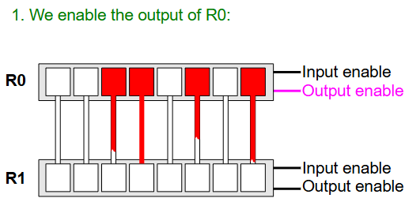
- enable(energize) latch input control line
>- 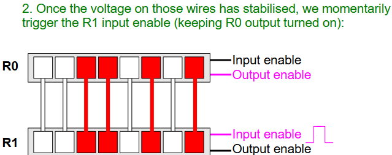
- memory cell is energized by input data line
- disable(discharge) latch input control line
>- 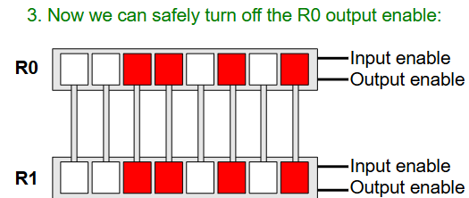

to write data (0) to r0[0]:
- energize input data line with LOW Signal voltage
- enable(energize) latch input control line
- memory cell is energized by input data line
- disable(discharge) latch input control line

apply this to each bit to copy data to registers
read from R0[0] by enabling enable output control line
write to R1[0] by enabling latch input control line

**Simplified Register Representation:**
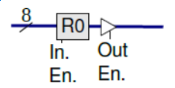  
OR  
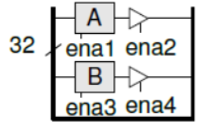

- Tristate buffers: used to arbitrate between registers, memory, I/O ports, etc...
>- 3 states are: HIGH, LOW, OFF
>- allows multiple registers to use the same bus to convey data
>- 

Over clocking and registers:
- circuits take time to charge or discharge and are affeted by length heat and other things.
- it is possible to clock faster than you circuits charge or discharge. meaning the computer attempts to read memory from register but opens and closes the latches too quickly to properly energize the circuit.
- This may happen even as the computer attempts to step to the next instruction and may result in incorrect values or crashes.  

**E.g. of correct clockspeed**  
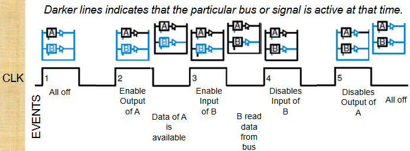

## The CPU (Chpt 2)

Hardware programming:  
>- actual electric voltage in wire  
>- Sequence of Arithmetic and logic functions by logic gates and chips  
>- result

Software programming:  
>- actual electric voltage in wire  
>- Sequence of Arithmetic and logic functions by logic gates and chips  
>- result

  

e.g.  

### The von Neuman Architecture  

Most modern day computers are based on von Neuman's stored program concept
1. Both data and program are stored in same memory
2. Contents of memory are addressable by location, without regard to data type
3. Execution occurs sequentially (unless explicitly modified)

### Components of Microcomputer

- Processor  
- Memory  
- I/O interfaces

all connected by bus structure  
Binary info can be transfered in parallel

### Main memory

- Fix-sized  
- high-speed  
- accessed in any order (i.e. RAM)  

each byte-sized location has **unique address** and is accessed by specifying its binary pattern on the **address bus**  

Address Bus size can be found out through the manufacturer who will declare it through the chip specs

Main memory size is dependant on number of lines (n) in the address bus. (memory size = $2^n$ bytes)  
1 line = 1 bit = 2 address  
2 lines = 2 bits = 4 address  
etc.

Memory stores both **data** and **instructiions**.  
e.g.  
> 0000 : + (instruction)  
> 0001 : B (data)  
> 0010 : C (data)  

If size > 8 bit, **consecutive locations** are used

32-bit data how to store?  
01234567 89ABCDEF GHIJKLMN OPQRSTUV,  
0 is MSB, V is LSB  

Big Edian (e.g. H8S, MAC, Sun, Motorola):  

> N+3 : OPQRSTUV  
> N+2 : GHIJKLMN  
> N+1 : 89ABCDEF  
> N+0 : 01234567   

Little Endian (e.g Intel, MSP430):
> N+3 : 01234567  
> N+2 : 89ABCDEF  
> N+1 : GHIJKLMN  
> N+0 : OPQRSTUV   

### Instruction in Memory:  
Instructions are stored as an **OP-code** followed by **Operands data**  

it tells CPU what action to take (i.e **executable**)  

**Op-Code** tells CPU which **operation to do** (e.g. add/subtract)  

rest of operands data specifies the **data / location of the data** to be used in the operation.

### Memory Map:  
is a visual means to show contents of some consecutive address space  
Generally drawn as byte-sized or word-sized  

Address and data represented in **Hexadecimal**

Byte:
> H'000003 : H'34  
> H'000002 : H'12  
> H'000001 : H'CD  
> H'000000 : H'AB   

Word:
> H'000006 : H'67B5  
> H'000004 : H'0000  
> H'000002 : H'1234  
> H'000000 : H'ABCD   

NOTE: each memory space still only store 1 byte. So word representation addess is 2 per memory  

for H'000002 : H'1234, H'000003 contents depends on Endian  

Big Endian:  
H'000003 : H'34  
H'000002 : H'12

Little Endian:  
H'000003 : H'12  
H'000002 : H'34

### Input Output (IO) Interfaces

2 ways to connect:
Loosely coupled: not always connected  
e.g.  
- via external bus - USB, SCSI, $I^2C$, Firewire  
- via network - Ethernet, ATM, airport (wireless)  
- via port - serial (RS232), parallel, P2S

Tightlly coupled: fixed onto computer - via fast internal bus - graphics & hard-disk controllers

peripherals still generally communicate with CPU the same way, thorugh I/O Interfaces:  
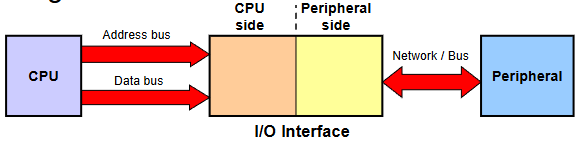

SSD/HDD are on motherboard but go through its own interface on motherboard.  
Because of the interface, SSD/HDD is much slower than primary memory.  
SSD/HDD also not dependant on address bus size, dependant on interface.  
Thus SSD/HDD are secondary memory.

types of I/O interface:
1. Parallel
2. Serial

### The CPU

Role:  
- **Fetch**: CPU fetch/read instruction from memory, CPU fetch/read data from memory after decoing what instruction needs  
- **Decode** instruction  
- **Execute**: Execute instruction (arithmetic or logic) on fetched data  
- **Write**: result may need to be written to temp register or to memory 

CPU as a whole accesses Control, Data and Address busses

## Register Section:  
Where all the registers are stored
- Visible General user registers(User Programs can read or write to)
- - Data registers: hold data temporarily during CPU operations
- - Address registers: holds addresses of operands in memory
- - Stack pointer: special register to manage stack in memory  
- Special user visible registers  
- - Status Register: current status of CPU and set of 1-bit flags that indicates outcome of ALU operations. Flags known as Condition Code Register **(CCR)**
- - Program Counter: address of next instruction to be executed, PC automatically increments after the execution of current instruction. (Important for security, if can control this, can jump to arbitrary code)
- Non-Visible user registers (User program cannot access)  
- - Instruction register - holds op-code of current instruction to be executed  
- - Temporary or buffer register:: holds address/data internally during intermediate stage of CPU op/instruction execution. (e.g. arithmetic op, I/O, interrupt, etc.)

Common Condition Code Flags
- Negative (N) - flag set whenever MSB of result is 1  
- Zero (Z) - flag set whenever result is zero (all bits 0)  
- Overflow (V) - flag et whenevver result cannot be represented by the 2' complement range of number representation. e.g. 16bit num + 16 bit num store into 16 bit register, if return 17bit number, flg will set  
- Carry (C) - flag set when result of addition causes a carry at MSB or subtraction causes a borrow at the MSB.  

Carry flag and overflow very different.  
Carry is for borrow or carry over, result may not overflow as logic may still be ok.

Overflow (V) in Arithmetic Ops:  
Addition: e.g.A+B=C
- set if $(A_{Sign}=B_{Sign} \neq C_{Sign})$, e.i. A MSB = B MSB but both != C MSB
- Why? Pos + Pos cannot be Neg

Subtraction: e.g.A-B=C
- set if $(C_{Sign}=B_{Sign} \neq A_{Sign})$, e.i. A MSB = B MSB but both != C MSB
- Why? Neg - Pos cannot be Pos OR Pos - Neg cannot be Neg

## ALU Section:  

performs arithmetic and logical ops specified by instruction.  
ALU takes input from Internal bus, outputs to internal bus and Condition Code Register

Number of lines on internal bus is found based on specifications of CPU e.g. **32-bit CPU means internal bus got 32-bits**  
Also **tells us how big the register** is,  
**32bit CPU = 32bit register**

ALU contains its own buffer register for temp storage of input operands and result

Arithmetic: + - * /  
logic: and, or, xor  
shifter: shift left, shift right, rotate

Control unit tells alu what to do in each cycle

Many operations will influence N,Z,V,C flags

## Control Unit:

Roles:
- Decodes instruction: decode opcode into internal and external control signals needed for execution  
- Activates ALU functions based on decoded instructions  
- Controls movemeent of data between memory-register or internally between registers  
- Handles external signals like interupt/reset

## Control and sequnencing:

Operations synchronised by master clock  
CPU can be seen as a sequential state machine  
each instruction has a number of micro operations. Each operation is perfomed at state change of CPU clock  
frequency can range from MHz-GHz

### Impact of Bus width

- CPU internal Bus: impacts number of bits CPU can process in one cycle  
- Data Bus: How much data can be transfered in one cycle. (speed of data transfer) e.g. 8-bit bus, want to store 16-bit, need 2 cycle  
- Address Bus: how large address space is, defined by manufaturer in specs (size of possible storage space)

MSB430 is 16bit data bus, memory size is 8bit.  
Limitation is when retrieving 16bit data, can only retrieve from even addresses due to the hardwiring of the 16bit bus

### Execution cycle

add.w #3, R1  
add word, value 3 to R1

Execution Cycle: Instruction  
1. fetch: program counter puts address of instruction on address bus,
2. Control unit generates read signal
3. CPU reads instruction fro memory to Instruction register over data bus  
4. Control unit decode instruction
- 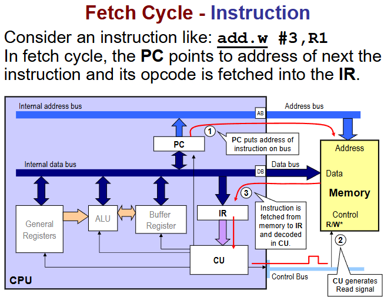

Execution cycle: Operand
1. Program counter send address of operand on address bus  
2. Control unit generate read signal  
3. Operand #3 fetched from memory to Buffer Register  
- 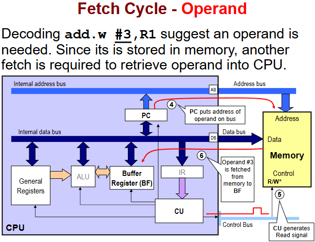

Execution cycle: Add  
1. Control Unit sends ALU signals to add Buffer register and R1  
2. result of addition is returned to R1, replacing original content.
3. any flags from the operation are set as well
- 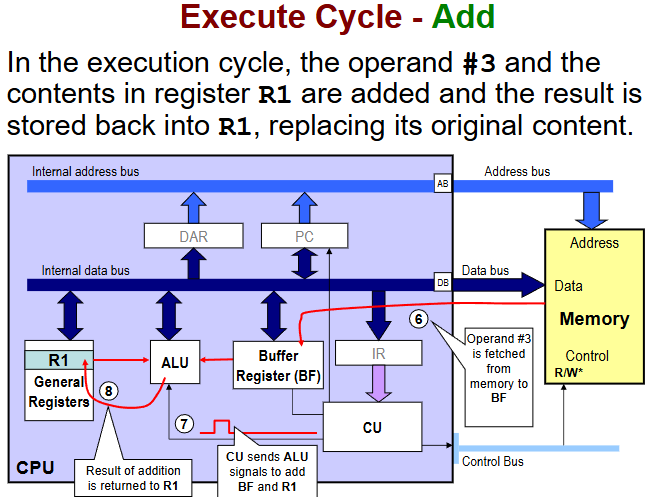

Execution flowchart (My interpretation):  
- **What we doing** - fetch, read and decode address of op/instruction  
- **What we doing it to** - generate address, fetch and read data+operand  
- **DO IT** - execute instruction,  
- **Send it back** - write back data if needed  
- **Run it back** - update program counter and go next

### Limitations of program execution on Von Neuman systems:

- Execution of single instruction may need multiple access to memory, meaning multiple clock cycles  
- External bus speed slower than internal bus. Performance limited by bandwidth between CPU and memory **(von Neuman Bottleneck)**
- Keeping regularly used operands in CPU registaer helps reduce memory access  
- Keeping instruction and data in seperte memories **(Harvrd architecture)** can help make instructions execute in more regular cycles, improving performance

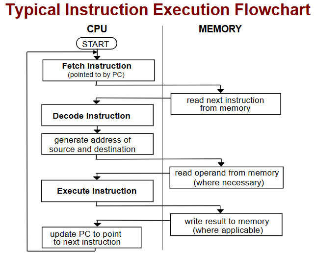

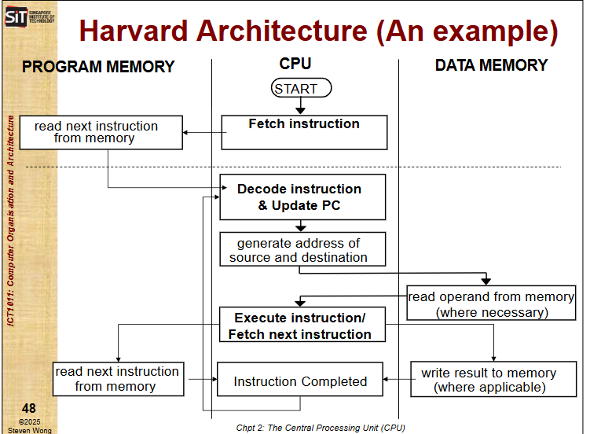

## Other architecture

Harvard:  
has 2 type of data bus.  
has 2 type of memory.

1 bus and memmory for program  
1 bus and memory for data

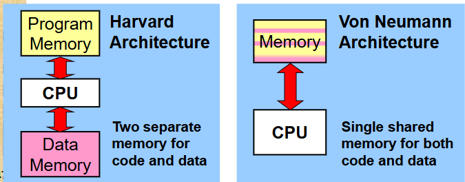

**"If instruction memory and data memory share data bus, still considered Harvard architecture"** - Prof Kong Peng-Yong

means can concurrently fetch next instruction and read/write from/to data memory at the same time

Harvard architecture not common since cost expensive and space expensive (more bus and memory = more wire and space)

still is useful in specific cases

## Flynn's Taxonomy

4 classifications based on:
1. number ofconcurrent instruction (or control)  
2. data streams availale in the architecture

**SISD**: Single instruction single data

**SIMD**: single instruction multiple data  
(carry out one operation on multiple sets of data, e.g. A+B and C+B concurrently)

**MISD**: Multiple instruction single data  
(generally used for redundancy)  
Multiple operations on same data.  
2 CPU doing different things.  
Can compare results between CPU

**MIMD**: Multiple instruction Multiple data  
(Multi-core processors)  
Each processor can do different operation on different set of data

### RISC and CISC

CISC: Complex Instruction Set Computer (e.g Intel processors up to Pentium)  
One instruction requiers CPU to perform multiple complex ops  

- Characteristics:
- - Complex instruction-decoding logic,
- - driven by the need for a single instruction to support multiple addressing modes  
- - instructions which requier multiple clock cycles to complete

RISC: Reduced Instruction Set Computer
- Characteristics:
- - Reduced instruction set (Number of op-codes supported)  
- - Less complex instructions  
- - Hardwired control unit and machne instructions  
- - Few addressing schemes or modes for memory operands with 2 basic instructions (LOAD and STORE)

Now modern processors use hybrid model (CISC like model running ISC instructions)

## Program Development process

Program can be written on a completely different computer than the target system.  
E.g. code in C, compile to Assembly, Link obj with library and data with linker, Download data to target machine, execute on target system  

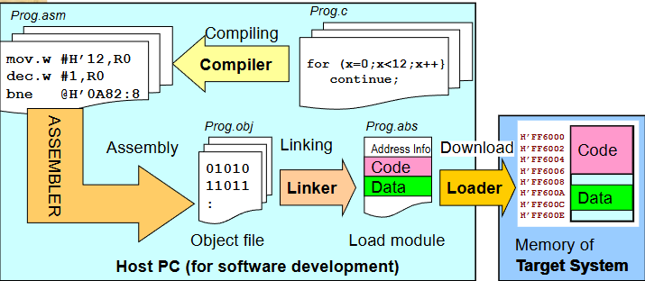

thus if MSP430 hang, restart computer wont help since the execution is on MSP430 processor and memory

## Instruction Set Architecture (Chpt 3)

### Microprocessors (μP) vs Microcontrollers (μC)

Micro**processor**:
- Forms core of system  
- has external memory and I/O support to provide operation capabilities  
- many mordern day desktops are microprocessor based systems

Micro**controller** (MCU or μC)
- has built-in memory and I/O support
- give rise to compact operational system

### Microcontrollers (μC) properties

- Integration: Able to implement a whole design onto a single chip.
- Cost: Are usually low-cost devices (a few $ each)
- Clock frequency: Compared with other devices (microprocessors
and DSPs),
- - MCUs use a low clock frequency:
- - MCUs today run up to 100 MHz/100 MIPS (Million Instructions Per Second).
- Power consumption: Low power (battery operation);
- Bits: 4 bits (older devices) to 32 bits devices;
- Memory: Limited available memory, usually less than 1 MByte;
- Input/Output (I/O): Low to high (8 to 150) pin-out count.

### MSP430 Characteristics and Architecture  

Low power consumption:  
- 0.1 μA for RAM data retention;  
- 0.8 μA for real-time clock mode operation;  
- 250 μA/MIPS during active operation.  

16-bit internal architecture, a 16-bit external data bus.  

is a Von-Neumennarchitecture - common bus to all memory and peripherals  

MAB - Memory Address Bus  
MDB - Memory Data Bus  

MAB 16 = **16bit Address Bus**

MDB 16 = **16bit Data Bus**

**16 bit RISC CPU**
- 27 core instrucction *(8 jump, 7 single and 12 double-operand instructions)*
- 7 addressing modes
- 8/16-bit instruction addressing format

Memory architecture
- 16x 16-bit registers *(4 dedicated-use and 12 general registers)*
- 16-bit Arithmetic Logic Unit (ALU)
- 16-bit data bus *(8-bit addressability aka can fatch as byte of as word)*
- Supports 8/16-bit peripherals
- Address bus size is dependent on model

R0 - R15 connected in parallel to ALU, fast transfer in 1 cycle  
allows direct tranfer of data from meory without passing through register  
allows memory to memory transfer as well  
constant generator - store commonly used numbers in register to reduce clock cycles from accessing main memory  

16 bit ALU  
MCLK (Master) clock signal drives the CPU  

R0 = **(PC)** Program Counter  
R1 = **(SP)** Stack pointer  
R2 = **(SR)** Status Register  
R3 / R2 = **(R2 = CG1, R3 = CG2)** Constant Generator

R4-R15 = General Purpose Regiester (aka working register)

R0-R15 are user accessible, **be careful where you write**  
R4-R15: single-cycle, general purpose and identical in all aspects, used for math, storage and addressing modes

### Program Counter

**16 bit** in MSP430  
**Each instruction** uses an **even number of bytes (2 4 6)**   
PC is incremented accordingly in even numbers  
Instruction accesses on the address space are performed on word boundaries, PC will treat 0 as 0 as is aligned to even addresses (i.e. 0x0000 0x0001 0x0002)  
Can be addressed by all instructions and all addressing modes

### Stack Pointer

store the return addresses of subroutine calls and interrupts.  
It also can be used to store local data.  
pre-decrement, post-increment scheme  

pre decrement: decrement SP then write  
post increment: pop then increment SP  
^ (does not clear popped value at popped memory address)  

means can dig through memory even after stacck has been "cleaned" without restart

### Status Register R2

when used as src or dst register:
- can only be used in register mode
- can only be addressed with word instructions

V,N,Z,C flags  
| 15| 14| 13| 12| 11| 10| 9 | 8 | 7 | 6  | 5  |  4   | 3 | 2 | 1 | 0 |
|:-:|:-:|:-:|:-:|:-:|:-:|:-:|:-:|:-:|:--:|:--:|:----:|:-:|:-:|:-:|:-:|
|[R]|[R]|[R]|[R]|[R]|[R]|[R]|[R]| V |SCG1|SCG0|OSCOFF|GIE| N | Z | C |

- 15-9 reserved (R)  
- 8 = (V) Overflow flag  
- 7 = (SCG1) System cclock generator 1, when == 1, turn off SMCLK  
- 6 = (SCG0) System cclock generator 0, when == 1, turn off DCO dc generator, if DCOCLK is not used for MCLK or SMCLK  
- 5 = (OSCOFF) Oscillator Off, when == 1, turn off LFXT1 crystal oscillator, when LFXT1CLK is not used for MCLK or SMCLK  
- 4 = (CPUOFF) CPU off, when == 1, turn off CPU  
- 3 = (GIE) General Interrupt enable, when == 1, enables maskable interrupts, when == 0 all maskable interrupts disabled  
- 2 = (N) Negative Flag  
- 1 = (Z) Zero Flag  
- 0 = (C) Carry Flag  

### Constant generators R2 / R3
 

Has way to store certain numbers  
has useful numbers e.g. for standard incrementation  
reduce requierment to store and fetch commonly used constants  
useful for reducing cycles as part of fetch-decode-execute  

Constant Generator values:
- #4, #8, #0, #1, #2, #-1
- values not in this list ^^ need to be stored elsewhere in mem

### Working Registers

can be used as data register, data pointers, indices  
accessed as either byte or word  
supports word and byte ops  

When accessed as byte as src, lower byte is used (15-8 high byte, 7-0 low byte)  
e.g.:
- R9 = 0x1234, R10 = 0x0000
- MOV.b R9, R10
- this reads lower byte and moves it to R10
- therefore, R10 = 0x0034

When accessed as byte as dst, higher byte is set to 0  
e.g.:
- R9 = 0x1234, R10 = 0xFFFF
- MOV.b R9, R10
- this reads lower byte and moves it to R10.
- since R10 has pre-existing data, upper byte set to 0x00
- therefore, R10 = 0x0034

### Memory

**MSP430 is Little endian**
Word alignment
- Bytes located at even OR odd addresses
- Words ONLY located at even addresses
- if tell to access word at odd address, will go to lower address e.g. access word at 0x0205h, will access from 0x0204h  

e.g.  
|Address| Data |
|-------| ---- |
|0x3004 | H'9A | 
|0x3003 | H'78 | 
|0x3002 | H'34 | 
|0x3001 | H'12 |

MOV.B &3000h, R8
- Register R8 will have a value of H’12.

MOV.W &3000h, R9
- Register R9 will have a value of H’3412.
- (MOV.W &3001h, R9 will produce the same result)

### Memory Map

MSP430 Memory:
- Unified Memory map (program or data)  
- no paging at all

FOR MSP430:  

### Machine code + ASSEMBLY INSTRUCTIONS

have 1 and 2 word instructions  
NOTE len(instruction) is **NOT** 1 or 2 word. 1 or 2 word is how many inputs for the instruction

|Op-code | Instruction |     Type      |
|:-------|:-----------:|--------------:|
|  0000  |  undefined  | Single Operand|
|  0001  | RCC, SWPB, RRA, SXT, PUSH, CALL, RETI | Single Operand|
|  0010  | JNE, JEQ, JNC, JC |  Jumps  |
|  0011  | JN, JGE, JL, JMP |   Jumps  |
|  0100  |     MOV     | Double Operand|
|  0101  |     ADD     | Double Operand|
|  0110  |     ADDC    | Double Operand|
|  0111  |     SUBC    | Double Operand|
|  1000  |     SUB     | Double Operand|
|  1001  |     CMP     | Double Operand|
|  1010  |     DADD    | Double Operand|
|  1011  |     BIT     | Double Operand|
|  1100  |     BIC     | Double Operand|
|  1101  |     BIS     | Double Operand|
|  1110  |     XOR     | Double Operand|
|  1111  |     AND     | Double Operand|

e.g. memory = 0100 0101 0000 0100 [mov.w r5, r4]

instruction set (single and double operands) supports 3 data types:  
- Bit  
- Byte (8bit, .b)  
- Word (16bit, .w)

by default if no suffix, trreted as .w

### Instruction format:

#### Double operand instrutions

|  0000  | 0000  | 0  |  0  | 00 | 0000  |
|:------:|:-----:|:--:|:---:|:--:|:-----:|
|Op-code | S-reg | Ad | B/W | As | D-Reg |

INST.[b/w] src, dst

- src: source operand address, as defined in **As and S-reg**;
- dst: destination operand address, as defined in **Ad and D-reg**;
- As: addressing bits used to define the addressing mode used by
the source operand;
- S-reg: (e.g. R4 = 0100) register used by the source operand;
- Ad: Addressing bits used to define the addressing mode used by
the destination operand;
- D-reg: (e.g. R10 = 1010) register used by the destination operand;
- B/W: (0:16-bits, 1: 8-bits) word or byte access definition bit.

#### Single operand instrutions

|0000 0000 0 | 0 | 00 | 0000 |
|:----------:|:-:|:--:|:----:|
|  Op-code   |B/W| Ad | D-Reg|

- Ad: Addressing bits used to define the addressing mode used by
the destination operand;
- D-reg: (e.g. R10 = 1010) register used by the destination operand;
- B/W: (0:16-bits, 1: 8-bits) word or byte access definition bit.

RRC (Rotate Right Carry) operation:
shift bits right 1, carry bit to MSB, LSB shifted out replace carry  
TBC

#### Jump instruction

|  000   |    000    |          00 0000 0000          |
|:------:|:---------:|:------------------------------:|
|Op-code | Condition | 10bit, 2's complement PC Offset|

Conditions  
- 000: jump if not equal (Z = 0)
- 001: jump if equal (Z=1)
- 010: jump if carry flag equal to zero (C = 0)
- 011: jump if carry flag equal to one (C = 1)
- 100: jump if negative (N = 1)
- 101: jump if greater than or equal (N = V)
- 110: jump if lower (N != V)
- 111: unconditional jump

jumps execcuted based on current PC and status register  
conditinoal jump controlled by status bits  
**Jump range**: **-511 to +512 words** OR **-1022 to 1024 bytes**, from current instruction address  

jump offset formula:  
- PC(new) = PC(old) + 2 + (PC(offset) * 2)
- where PC(old) is address of jump  
- (PC(old) + 2) is normal PC increment  
- (PC(offset) * 2) is additional increment or decrement if condition fulfilled

### Addressing modes

Opcode tells ALU what op to do, **BUT** dependant on addressing mode  
source operand : 7 addressing modes  
destination operand : 4 address modes  
operands can be in any memory space address (be aware of effects of things like R0-R3)  
Addressing modes selected by **As** and **Ad**

SRC Modes (all registers):
1. Rs - Register Mode
   - use content of register as operand
   - can be used for src and dst
2. x(Rs) - Indexed Register
   - +1 cycle (fetch,read offset) +1 cycle(exec,read value) for each use
   - memory address of value is (x + value_in_Rs)
   - value of x is stored in next mem address after inst addr
   - Content of Rs not affected
   - PC increment to next inst to exec
   - Useful to access data in tables
3. @Rs - Register Indirect (R1, R4-15)
   - +1 cycle (fetch,read offset) +1 cycle(exec,read value) for each use
   - only for src
   - same as 0(Rs) but does not need to store offset value after inst
   - use Register as mem addr for value
4. @Rs+ - Indirect Auto-increment
   - +1 cycle (fetch,read offset) +1 cycle(exec,read value) for each use
   - only for src, only dual operand inst
   - user Register as mem addr for value
   - Increments the **SRC**
     - if data value == byte: src+1
     - if data value == word: src+2

Additional SRC modes (for R0/R2):
- label/symbol - symbolic mode, PC Relative
  - ASM: x(PC)
  - +1 cycle (fetch,read offset) +1 cycle(exec,read value) for each use
  - mem addr of value is offset from PC
  - does not change PC
  - code composer calculates offset for label for you
  - offset stored in mem addr after inst
  - if used for src and dst, inst addr + 1 is src offset, inst addr +2 is dst offset
- &label/&symbol - Absolute
  - ASM: x(SR)
  - +1 cycle (fetch,read offset) +1 cycle(exec,read value) for each use
  - mem addr of value is stored as a constant after inst addr
- #n - Immediate, <!-- @PC+ -->
  - +1 cycle (fetch,read) for each use (if value not in constant generator)
  - value of src is actual value to be used
  - stored in mem addr after inst (unless value can be found ni constant generator)

DST Modes (all registers):
1. Rd - Register Mode
2. x(Rd) - Indexed Register

Additional DST modes (for R0/R2):
- label - PC Relative, x(PC)
- &label - Absolute, x(SR)

MSP430 cycle usage:
- fetch from mem : 1 cycle per mem addr (due to 16bit bus and word size mem)
- decode instruction: 0 cycle (due to hardwiring)
- read from register: 0 cycle
- read from external memory: 1 cycle per address
- write to register: 0 cycle
- write to external memory: 1 cycle per address
- ALU / adder = 0 cycles to perform function

## Low-level programming (Chpt 4-6)

## Chap 4: Introduction to ASM

### TF is assembly

|High level langs|Asm|Machine code|
|:-:|:-:|:-:|
|e.g.: C, C++, Java, Basic|Asm|Binary|
|Easy to Write|uses mnemonics of basic instructions|exact binary bits to instruct processor to carry out instructions|
|Easy to understand|Not as easy|
|Performs data type casting/checking|Compiles from High Level Langs|
|limited/no knowledge needed about processor| Need good knowledge on exact ops processor needs to perform|
|No details running speed / amoumt of memory to store instructions|can calculate memory needed to store code and execution time|

Kinds of statements:
1. Executable instructions
2. Assembler directives

### Why ASM

1. Very efficient codes by:  
   - Reduced overheads (e.g. data type checking)
   - Compact file size
   - Faster execution (e.g. real time signal processing)

### When ASM?

1. When critical to OS (e.g. kernal)
2. Input/Output intensive codes (e.g. device driver, streaming data)
3. Time-critical / time dependant codes

### How ASM (ASM program development)

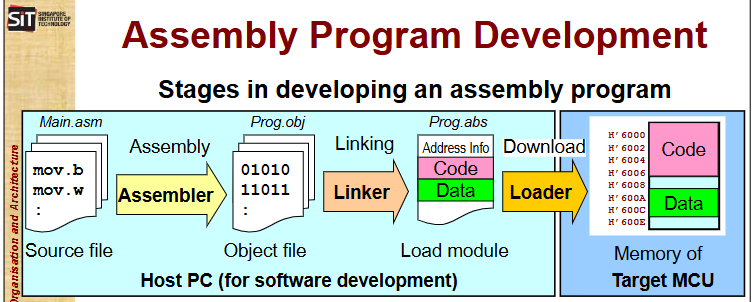

|Text editor|edit src file text, mnemonics (*.asm)|
|:---------:|:-------------------:|
|Assembler  |convert mnemonics in src file to machine code, produce obj file (*.obj)|
|Linker     |combine several obj files into load module that contains machine code and address info (*.abs)|
|Loader     |use load module address info, download instruction and data constants into appropriate memory areas for execution|

### What ASM look like (Characteristics)

Made up of:
1. Executable Instructions
  - valid inst for proccessor
  - actually executed when program run
2. Assembler directives
  - tell assembler desired characteristics of program
  - used during program assembly
  - influencce the way program is loaded to memory
  - generally start with a dot, e.g. .retain

Example:  
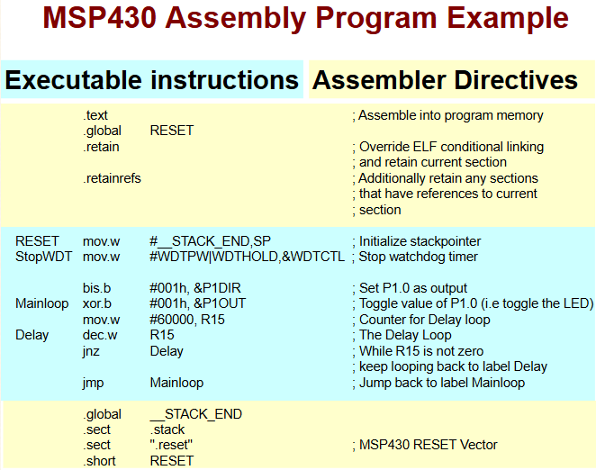

|Layout|||||
|-|-|-|-|-|
|label|mnemonic|Operand List| Commments|
|[label[:]]|mnemonic|[operand list]|[;comment]|

MSP430 assembler
- max 200 char per line, excess truncated

### ASM Guidelines:
1. all statements must begin with a label, a blank, an asterisk or semicolon
2. Label optional, if used must be column 1
3. 1+ blank to seperate fields, tab and space works
4. Comments optional,Comments that begin in column 1 can begin with an asterisk or a semicolon (* or ;), but comments that begin in any other column must begin with a semicolon.
5. mnemonic cannot begin in column 1

### Label Field
1. optional for all instruction and most directives
2. must begin in ccolumn 1
3. contain up to 128 alphanumeric char (A-Z, a-z, 0-9, _, and $)
4. Case sensitive, 1st char not number
5. after label can colon (:)
6. label on line by itself is valid
7. if no label, leave blank, semicolon or asterisk

### Address and Value Labels
- used as a reference to the address of an instruction or data (address label).
- used with the .equ directive, it takes on the value of the equated constant (value label).

### Mnemonic Field
- Machine-instruction mnemonic (such as ADD, MOV, JMP)
- Assembler directive (such as .data, .list, .equ)
- Macro directive (such as .macro, .var, .mexit) [Not covered in this mod]
- Macro call [Not covered in this mod]
- May require suffix

### Operand Field
- not required for all inst or directive
- consits of symbols, constants, expressions
- must seperate operands with commas
- num operands needed depend on instruction

- Constants in operand field treated as unsigned
- Can be in dec, hex [0x, 0...h, 0...H], oct [0...Q, 0...], bin

- Expressions
- a constant, symbol or seriese of constants and symbols separated by arithmetic operators
- assembler will calculate and convert to machine code. e.g. mov,w #1+2,R5 -> mov.w #3,R5
- main factorsinfluence order of eval:
  - Parentheses -> Precedencce groups -> left-to-right
- 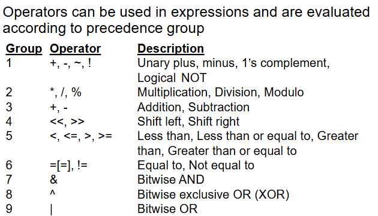

### Comments
- ignored by assembler
- for humans, program documentation
- use semicolon before comment

### Symbols

1. used as labels, constants, and substitution symbols
2. symbol name is a string of up to 200 alphanumeric characters (A-Z, a-z, 0-9, $, and _)
3. cannot contain embedded blanks
4. first character cannot be a number
5. case sensitive
6. when used as label, becom symbollic addr associated with loc in program
7. labels locally in file must be unique

### Assembler Directivves

1. supply data to program
2. control assembly process

Asm Dir enable
- assemble code and data into specified sections
- reserve space in mem for uninitialised vars
- control appearance of listings
- init mem
- def global var
- speccify which lib asm can get macros from
- ++

Common dir:
1. select assembler section
    - .sect, .text, .bss, .usecct
2. def val for mem loc
    - .byte, .word, .string, .space
3. create symbol table entries
    - .equ, .set
4. def lib references and definitions
    - .global, .ref, .def
5. Specify end of program
    - .end

#### Selecting Assembler Section

- block of code / data
- occupies contiguous space in mem map
- each sect has own Location Counter used to assign mem addr to program statement
- types
  1. Initalized sect w/ data or code (modal)
  2. Uninitalized sect reserving space in meme map for uninitalized data (temporary)

Location Counter
- hold relative mem pos of an instruction in current sect
- as inst in source module are being assembled, loc ccounter keeps track of current loc in mem
- $(dollar sign) can be used as an operand to an inst to refer to the current val of loc counter

When assembler sees:
- .data, .sect, .text
  - assembler stops assembling in current sect, begins assembling in indicated section
  - data will not be lost on power down
  - ensure you alloc these to ROM
- .bss, .usect
  - assembler *does not* end the current section, but simply escape from the current section temporarily
  - uninitialized directives .bss and .usect can appear anywhere in an initialized section without affecting its contents.
  - data in this will be lost on power down
  - ensure you alloc these to RAM

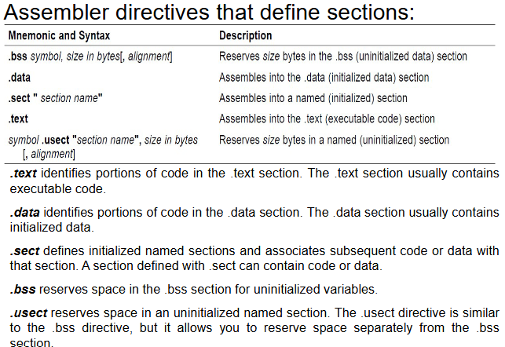

#### Defining val for mem loc

|Mnemonic and Syntax|Desc|
|-|-|
|.byte val$_1$[,..., val$_n$]|Init one or more successive bytes in current pos in section mem map|
|.double *floating point val*|Init 48-bit MSP430 floating point constant in current pos in section mem map|
|.float *floating point val*|Init 32-bit MSP430 floating point constant in current pos in section mem map|
|*label* .space *Size in bytes*|Reserve *size* bytes in current set; note - a label points to beginning of reserved space|
|.string *"string$_1$"*[,...,*"string$_n$"*]|Init one or more text strings in current pos in section mem map, each char convert to ASCII and stored 1st char lowest addr|
|.word val$_1$[,..., val$_n$]|Init one or more 16-bit integers|
|.bss *"label"* *size in bytes*|Init new secction called *"label"* with Size *size in bytes*, set *"label"* loc counter to next unreservved addr, and return back to previous section|
|.usect *"label"* *size in bytes*|Init new section called *"label"* with Size *size in bytes*, set *"label"* loc counter to next unreservved addr, and return back to previous section|

#### Creating symbol table entries

|Mnemonic and Syntax|Desc|
|-|-|
|*symbol* .set *val*|def variable val|
|*symbol* .equ *val*|def absolute constannt|

FP .set R11 ; Ok
_ mov.w @FP,R10 ; Ok
FP .set R15 ; Ok
count .equ 100/2 ; ok

#### Defining lib references and definitions

|Mnemonic and Syntax|Desc|
|-|-|
|.ref *symbol*|refer to routine(aka func)|
|.def *symbol*|define routine|
|.global *symbol*|def and ref|

Lib
- is a set of routines for specific domain application, e.g. math, GUI
- use .ref dir to reference symbols outside a prog

Lib routine invocation
- labels for routines defined as .def
- each lib routine conaians own symbol table
- linker resolves external addr before creating exe

.global decclare symbol to be external so is available to other modules at link time. Does def for defined symbols and ref for undefined symbols at the same time

#### Specify end of prog

|Mnemonic and Syntax|Desc|
|-|-|
|.end |tell assembler to stop assembling|

optional directive
shld be used as last source statement
assembler ignores any source statements after .end
can use when debugging

### How ASM (Assembly Process)

Pass 1: Find all label and addr for each label, store in symbol table
Pass 2: convert inst to machin lang, using symbol table

Asm inst have 1-to-1 correspondance from .asm to .obj

# Computer Organisation

## Input / Output Techniques (Chpt 7)

## Primary Memory Subsystems (Chpt 8)

## Secondary Memory Subsystems (Chpt 9)

# Tutorials

## Tut 1

Q1a: RISC, since is 1 instruction in few cycles  
Q1b: CISC, since is multi op in 1 instruction  
Q1c: RISC, since is 1 instruction  
Q1d: CISC, since is multi clock in 1 instruction

Q2a: SISD  
Q2b: SIMD  
Q2c: MIMD  

Q3:

Rating 1,2,3 - 1 best, 3 worst

CPU A:  
- Von Neuman  
- System cost

CPU B:  
- Harvard

CPU C:  
- Harvard

Q4a: Arch 1 since have 22 parallel busses  
Q4b: none. need 1 clock to read info, and 1 clock to store info assuming no need clock cycle to process  
Q4c: Arch 3, can read output in one cycle rather than write back to registers and read again from registers like arch 1 and 2

**ANS KEY:**
Q1: CISC, CISC, RISC, CISC

Q2: SISD, SIMD, MIMD

Q3:  
Rating 1,2,3 - 1 best, 3 worst

- System cost: based on num buses and separate meory spaces  
- Device cost: approx system cost  
- Ease of programming: von Neuman, no separation of memory space/unique memory address. Easier to fetch next instruction if all in same memory.  
- Pin count: tied to number of buses  
- Performance, Pure harvard is faster since instruction and data can be fetched separately in one cycle

CPU A:  
- Von Neuman  
- System cost 1=cheap: 1
- Device cost 1=cheap: 1
- Ease of programming 1=easiest: 1
- Pin count 1=lowest: 1
- performance 1=best: 2

CPU B:  
- Harvard
- System cost 1=cheap: 2
- Device cost 1=cheap: 2
- Ease of programming 1=easiest: 2
- Pin count 1=lowest: 1
- performance 1=best: 2

CPU C:  
- Harvard
- System cost 1=cheap: 3
- Device cost 1=cheap: 3
- Ease of programming 1=easiest: 2
- Pin count 1=lowest: 2
- performance 1=best: 1

Q3 Extension: Arch CPU C

Q4:  
Arch 1: 2 bus to ALU, results can be sent back using both  
Arch 2 one bus for all inputs and all outputs  
Arch 3: one bus for all input and output. ALU has a bus from output back to one input

4a : Arch 1  
4b : None  
4c : Arch 3 has dedicated bus for this but arch 1 is almost the same. Arch 2 is less effecient than both

## Tut2 ANS

for subtraction: assume CPU perform 2's complement addition and the status flags will set/clear based on addition

Q1a:

|$^1$| | | | | | | | |
|----|-|-|-|-|-|-|-|-|
|    |1|0|0|1|1|0|0|1|
|  + |1|1|0|0|0|0|0|0|
| [1]|0|1|0|1|1|0|0|1|
C = 1, V = 1
is overflow since (A(Sign) and B(Sign)) != C(Sign)

Q1b:

|$^1$|$^1$|$^1$|$^1$| | | |$^1$| |
|----|----|----|----|-|-|-|----|-|
|    |  1 |  0 |  1 |1|0|1|  0 |1|
|  + |  1 |  1 |  0 |1|0|0|  0 |1|
| [1]|  1 |  0 |  0 |0|0|1|  1 |0|
C = 1, n = 1

Q1c:
0xFF + 0x01
|$^1$|$^1$|$^1$|$^1$|$^1$|$^1$|$^1$|$^1$| |
|----|----|----|----|----|----|----|----|-|
|    |  1 |  1 |  1 |  1 |  1 |  1 |  1 |1|
|  + |  0 |  0 |  0 |  0 |  0 |  0 |  0 |1|
| [1]|  0 |  0 |  0 |  0 |  0 |  0 |  0 |0|
C = 1, Z = 1 (WHY NO OVERFLOW?)
is not overflow since (A(Sign) != B(Sign))

Q1d:
0x26 + 0x54
|    |$^1$|$^1$|$^1$|$^1$|$^1$|$^1$|    | |
|----|----|----|----|----|----|----|----|-|
|    |  0 |  0 |  1 |  0 |  0 |  1 |  1 |0|
|  + |  0 |  1 |  0 |  1 |  1 |  0 |  1 |0|
| [0]|  1 |  0 |  0 |  0 |  0 |  0 |  0 |0|
V = 1, N = 1

Q1e:
1010 1010 - 1010 1010  
2's comp:
1010 1010 -1 = 1010 1001
= 0101 0110

|$^1$|$^1$|$^1$|$^1$|$^1$|$^1$|$^1$|    | |
|----|----|----|----|----|----|----|----|-|
|    |  1 |  0 |  1 |  0 |  1 |  0 |  1 |0|
|  + |  0 |  1 |  0 |  1 |  0 |  1 |  1 |0|
| [1]|  0 |  0 |  0 |  0 |  0 |  0 |  0 |0|
z = 1,, c = 1
is not overflow since (A(Sign) != B(Sign))

Q1f:
0011 0010 - 0100 1100  
2's comp:
0100 1100 - 1 = 0100 1011
= 1011 0100

|    |    |$^1$|$^1$|    |    |    |    | |
|----|----|----|----|----|----|----|----|-|
|    |  0 |  0 |  1 |  1 |  0 |  0 |  1 |0|
|  + |  1 |  0 |  1 |  1 |  0 |  1 |  0 |0|
| [0]|  1 |  1 |  1 |  0 |  0 |  1 |  1 |0|
N = 1
is not overflow since (A(Sign) != B(Sign))

Q1g:
0xCF - 0x89 = 1100 1111 - 1000 1001
2's comp:
1000 1001 - 1 = 1000 1000
= 0111 0111

|$^1$|$^1$|$^1$|$^1$|$^1$|$^1$|$^1$|$^1$| |
|----|----|----|----|----|----|----|----|-|
|    |  1 |  1 |  0 |  0 |  1 |  1 |  1 |1|
|  + |  0 |  1 |  1 |  1 |  0 |  1 |  1 |1|
| [1]|  0 |  1 |  0 |  0 |  0 |  1 |  1 |0|
C = 1
is not overflow since (A(Sign) != B(Sign))

Q1h:
0x83 - 0x11 = 1000 0011 - 0001 0001
2's comp:
0001 0001 - 1 = 0001 0000
= 1110 1111

|$^1$|    |   |    |$^1$|$^1$|$^1$|$^1$| |
|----|----|----|----|----|----|----|----|-|
|    |  1 |  0 |  0 |  0 |  0 |  0 |  1 |1|
|  + |  1 |  1 |  1 |  0 |  1 |  1 |  1 |1|
| [1]|  0 |  1 |  1 |  1 |  0 |  0 |  1 |0|
v = 1, c = 1
is overflow since (A(Sign) and B(Sign)) != C(Sign)

-----------------

Q2a
R5 = 0000 0110 = #6
R6 = 0000 0110 = #6

Note:  
MOV.b #6,R5 can be considered direct address

Q2b
Z means off
|Instruction|Step|PC |   IR    |Data Bus |Address Bus|R5 |R6 |
|:---------:|:--:|:-:|:-------:|:-------:|:---------:|:-:|:-:|
|MOV #6, R5 |  0 | 0 |    0    |    Z    |     Z     | 0 | 0 |
|           |  1 | 0 |    0    |MOV #6,R5|     0     | 0 | 0 |
|           |  2 | 0 |MOV #6,R5|    Z    |     Z     | 0 | 0 |
|           |  3 | 1 |MOV #6,R5|    6    |     Z     | 0 | 0 |
|           |  4 | 1 |MOV #6,R5|    Z    |     Z     | 6 | 0 |
|           |  5 | 0 |MOV #6,R5|    Z    |     1     | 6 | 0 |
|-----------|----|---|---------|---------|-----------|---|---|
|ADD R5,R6  |  6 | 0 |MOV #6,R5|ADD R5,R6|     1     | 6 | 0 |
|           |  7 | 0 |ADD R5,R6|    Z    |     Z     | 6 | 0 |
|           |  8 | 0 |ADD R5,R6|    6    |     Z     | 6 | 0 |
|           |  9 | 0 |ADD R5,R6|    0    |     Z     | 6 | 0 |
|           | 10 | 0 |ADD R5,R6|    6    |     Z     | 6 | 6 |

Note, registers do not have addresses. only memory has addresses  
in ASM, even if you write R5 and R6 as src and dst in the instruction, they dont actually have an address since is register

Q2c

Cannot be MSP430 since MSP430 instructions are always stored as even addresses

---------------

Q3a
|Address |Content|
|--------|-------|
|0x00220B| 0x56  |
|0x00220A| 0xB6  |
|0x002209| 0xa5  |
|0x002208| 0x31  |
|0x002207| 0x31  |
|0x002206| 0x30  |
|0x002205| 0x31  |
|0x002204| 0x54  |
|0x002203| 0x43  |
|0x002202| 0x49  |
|0x002201| 0xBB  |
|0x002200| 0xE7  |

Q3b
(i) H`31
(i1) H`3154
(iii) H\`31 H\`31 H\`30 H\`31 H\`54 H\`43 H\`49  

31 = 0011 0001 = 1
31 = 0011 0001 = 1
30 = 0011 0000 = 0
31 = 0011 0001 = 1
54 = 0101 0100 = T
43 = 0100 0011 = C
49 = 0100 1001 = I

## Tut3

1.
Assume MSP430
a. R11 0x0034
R0 = 0x4432

b. R11 0x3002
R0 = 0x4432

c. R11 0xFFFF
R0 = 0x4434

d. R11 0xFACE
R0 = 0x4434

e. R11 0xFACE
R0 = 0x4432

f. R11 0xFACE
R12 0x3004
R0 = 0x4432

g. R11 0x0078
R0 = 0x4434

b. 0x3002 =  0x78
0x3003 = 0x00
R0 = 0x4436

2.
a.
ADD.W R10,R9
0101 1010 0 0 00 1001
0x5A09

b.
MOV.W #0,R9
0100 0011 0 0 00 1001 
0x4309

c.
MOV.B &5566H,R9
0100 0010 0 1 01 1001
0101 0101 0110 0110
0x4259
0x5566

d,
MOV.W &2233H,&5566h
0100 0010 1 0 01 0010
0010 0010 0011 0011
0101 0101 0011 0011
0x4292
0x2233
0x5566

e.
PUSH.W R1
0001 0010 0 0 00 0001
0x1201

f.
RETI
0001 0011 0000 0000
0x1300

3.
mov.w R10,R11
size 1 word
Fetch 1 cycle
decode 0
exec 0
write 0

mov.w @R10,R11
size 1 word
Fetch 2 cycle
decode 0
exec 1 cycle
write 0

a. need extra exec cycle as need read data from memory at addr (Value of R10)

b.
fig q3a uses 6 words 12 byte, and 9 cycles to complete
fig q3b uses 4 words 8 byte and only 5 cycles to complete

c.
MSP430 reduces the size of the instruction from 2 word to 1 word with the constant generator and reduces the number of cycles to execute from 2 to 1.
Without the constant generator, the instruction will need to store the value of #0 in the next mem addr after the inst.
It reduces the exec cycles as reading from the constant generator uses 0 cycles but reading the value from memory uses 1 cycle

## Quiz 1:

- 16bit RISC
- PUSH #1000h, SP @ 1234, Value of R1 i.e. SP after exec = 1232
- R0 = PC
- Instructions len = even, 2,4,6
- according to quick reference : [0100][1010][0][1][00][1011] = 4A4B
- 16 bit data bus
- mov.b R9, R10,
- - where R9=0x1234, R10=0x6789:
- - when move byte, use lower byte and zero upper byte
- 1234 stored at 2000H: 
- - 2000H = 34H 
- - 2001H = 12H

## Lab 2

1. Task 1
   - mov.b # -1, R5 R5 = 0x00FF
   - mov.w # -1, R6 R6 = 0xFFFF
   - mov.w # -1234, R7 R7 = 0xEDCC
   - mov.w # -1234h, R8 R8 = 0xEDCC
   - mov.w # 'ABC', R9 R9 = ????
2. Task 2
   - mov.b # -1, R5 R5 = 0x00FF
   - mov.w # -1, R6 R6 = 0xFFFF
   - mov.w # -1234, R7 R7 = 0xFB2E         This is because no h suffix, so -1234 is decimal which gets converted to binary
   - mov.w # -1234h, R8 R8 = 0xEDCC
   - mov.w # 'ABC', R9 R9 = 0x4241         0x41 is 65 which in ASCII is A, wince is word only able to store 'AB', C is dropped
3. Task 3
    mov.b #01h, &2400h
    mov.b #0Ah, &2401h
    mov.w #1234h, &2402h
    mov.w #5678h, &2403h
    mov.w #9ABCh, &2404h

    0x2405: 0x9A
    0x2404: 0xBC
    0x2403: 0x12 then 0x56
    0x2402: 0x34 then 0x78
    0x2401: 0x00
    0x2400: 0x01 then 0x0A
    
4. Task 4
    mov.b #01h, &2400h
    mov.b #0Ah, &2401h
    mov.w #1234h, &2402h
    mov.w #5678h, &2403h
    mov.w #9ABCh, &2404h

    0x2405: 0x9A
    0x2404: 0xBC
    0x2403: 0x12 then 0x56
    0x2402: 0x34 then 0x78
    0x2401: 0x0A                Can address odd addr if doing byte op
    0x2400: 0x01
5. Task 5
   add.w R1, R2 = 0101 0001 0000 0010, 2 byte
   mov.w #1234h, R1 = 0100 0000 0011 0001    0001 0010 0011 0100, 4 byte
   sub.b #5566h, &3000h = 1000 0000 1111 0010    0101 0101 0110 0110    0011 0000 0000 0000
6. Task 6
    add.w R1, R2 = 0101 0001 0000 0010, 2 byte, 0x5102
   mov.w #1234h, R1 = 0100 0000 0011 0001    0001 0010 0011 0100, 4 byte, 0x4031 0x1234
   sub.b #5566h, &3000h = 1000 0000 1111 0010    0101 0101 0110 0110    0011 0000 0000 0000, 6 byte, 0x80F2 0x5566 0x3000

## Lab 4

